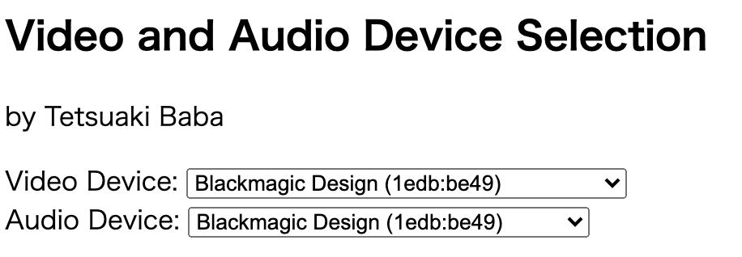

# Simple Example for selecting video/audio devices works only chrome browser.

## How to use
```
$ git clone https://github.com/TetsuakiBaba/selectVideoAudioDevices.git
$ cd seleceVideoAudioDevices
$ npm init
$ npm install express
$ node server.js
```
Then check http://localhost:80 on Chrome browser and open javascript console to see what device you selected.

